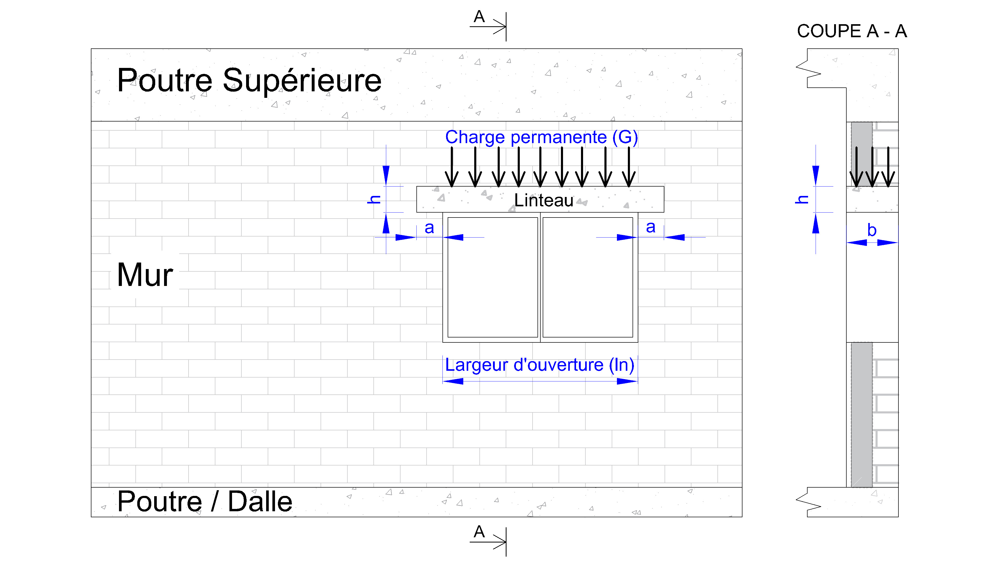
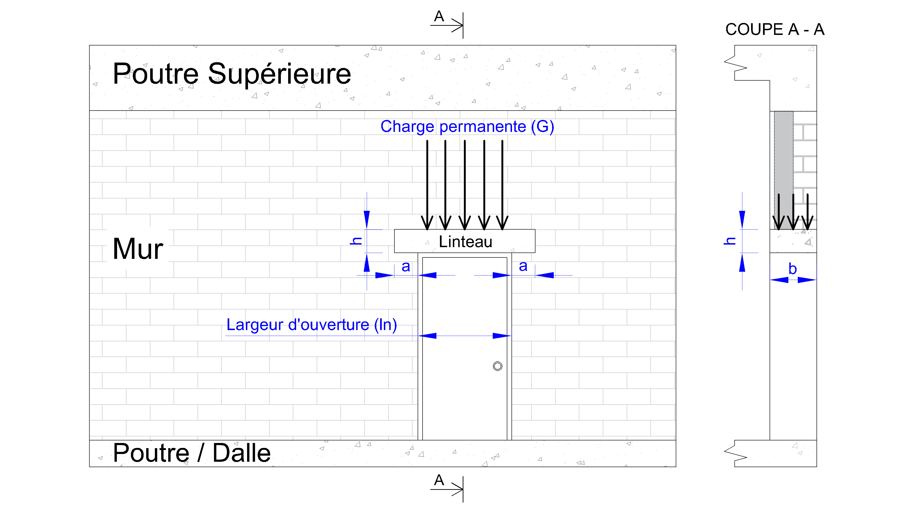
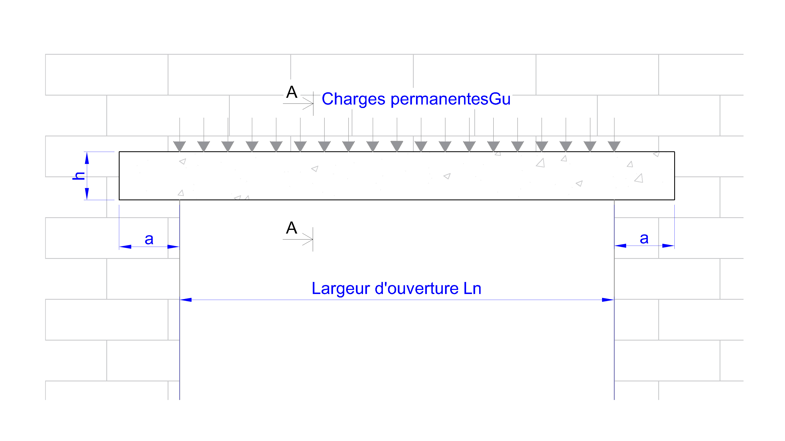
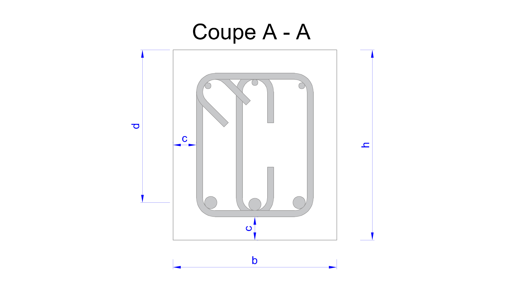

# Outil de Calcul Automatique de Sections d’Acier pour Linteau en Béton Armé

Cet outil libre et open source permet de dimensionner les linteaux en béton armé selon l’Eurocode 2.  
Il calcule automatiquement la section d’acier requise en fonction des charges et des données saisies.  
Accessible en ligne, il favorise l’interopérabilité et contribue au bien commun en fournissant une ressource gratuite et transparente pour ingénieurs, architectes et étudiants.

---

## Fonctionnalités principales
- Calcul automatique des sections d’acier pour linteau.  
- Respect strict des prescriptions de l’Eurocode 2.  
- Interface intuitive avec saisie interactive des données.  
- Détection automatique des incohérences et propositions de correction.  
- Résultats préliminaires à valider par un bureau d’étude.  
- Open source, conçu pour le partage, la transparence et la réutilisation.  

---

## Mode d’emploi

L’outil est conçu pour le calcul automatique des sections d’acier de linteaux placés au-dessus d’ouvertures (portes, fenêtres) dans les murs porteurs.  
Il est destiné aux **linteaux soumis à une charge uniformément répartie**, avec appui direct sur les murs latéraux.

### Étapes principales
1. **Définir les charges**  
   - Calculez la charge permanente `G` via notre [outil de descente de charge](https://beton-guide.com/calcul/calcul-descente-de-charge-des-murs-outil-gratuit-en-ligne.html).  
   - Saisissez la charge uniformément répartie `Gu` (kN/m).  

2. **Entrer les dimensions du linteau**  
   - Indiquez la largeur et la hauteur.  
   - Une estimation initiale de la hauteur utile est proposée (d ≈ 0,9 × h).  
   - Les incohérences sont signalées automatiquement.

 

3. **Lancer le calcul**  
   - Le système vérifie automatiquement la cohérence des données.  
   - L’absence de signal d’erreur garantit la conformité Eurocode 2.  

4. **Résultats**  
   - Section d’acier minimale requise.  
   - Tableau complet de dimensionnement.  
   - Conseils de mise en conformité avec l’Eurocode 2.  

⚠️ **Important** : Les résultats sont fournis à titre préliminaire.  
Un **bureau d’études spécialisé** doit impérativement valider toute application en chantier.

Pour accéder à la version complète avec le ferraillage automatique des arrêts de barres, des ancrages de chaque lit d'acier, du diamètre de mandrin et du retour pour le façonnage des barres selon les exigences de l'EC2, consultez [beton-guide.com](https://beton-guide.com/calcul/calcul-linteau-beton-arme-automatique-outil-gratuit-en-ligne.html).

---

## Conformité et cadre normatif
- Basé sur **l’Eurocode 2** (EN 1992) pour les structures en béton armé.  
- Favorise la rigueur et la reproductibilité scientifique.  
- Développé comme une ressource **interopérable et accessible**, en formats ouverts.  

---

## Licence et Communauté

- Diffusé sous **licence libre** pour encourager la collaboration.  
- Chaque utilisateur peut consulter, vérifier et améliorer les calculs.  
- Toute contribution visant à renforcer la **précision**, l’**interopérabilité** et l’**accessibilité** est la bienvenue.  
- L’outil s’inscrit dans une démarche de **bien commun numérique** soutenue par l’esprit du programme **NGI Zero Commons Fund**.  

---

## Responsabilité

Les administrateurs déclinent toute responsabilité en cas d’utilisation sans validation professionnelle.  
Cet outil n’est pas un substitut à l’expertise d’un **ingénieur structure**.  

